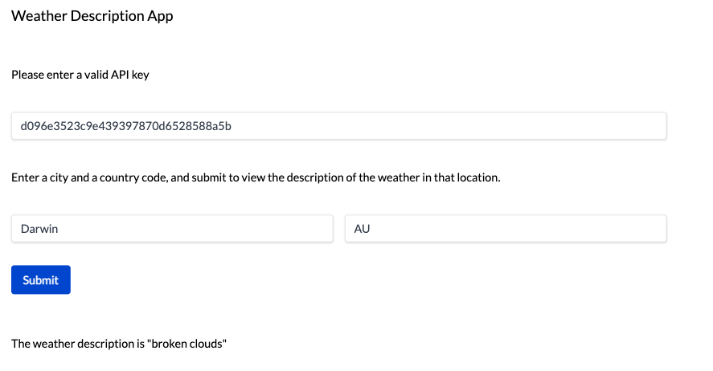
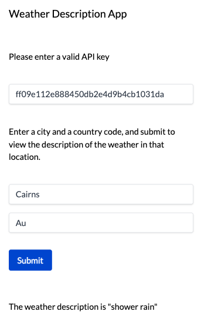
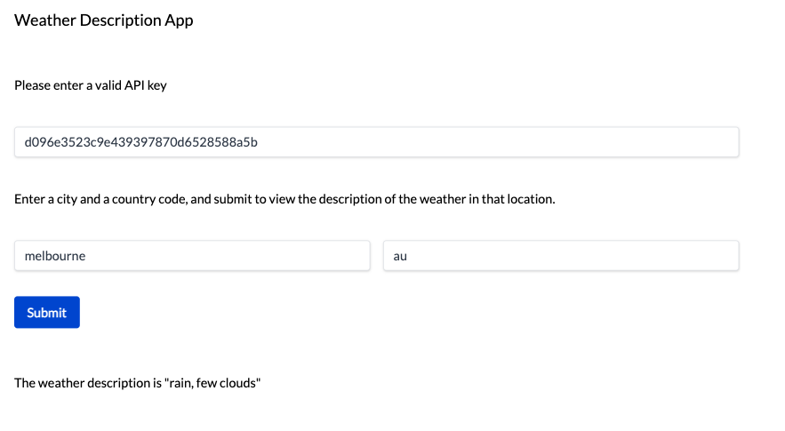
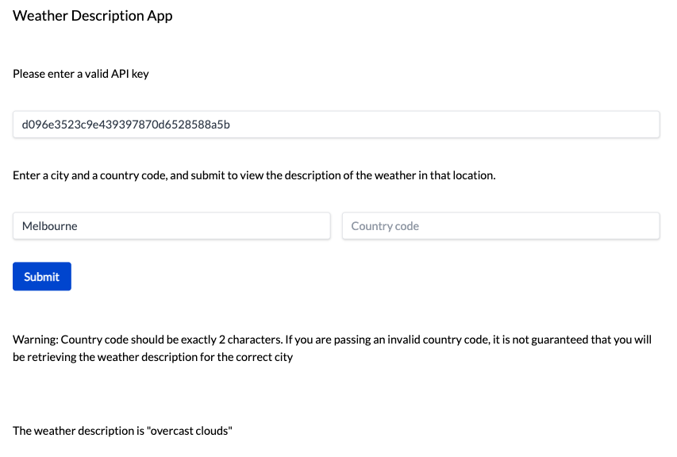
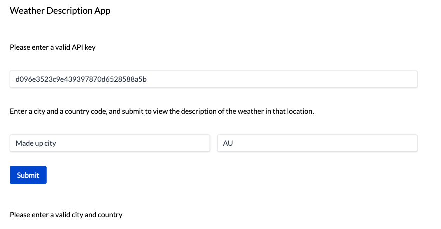
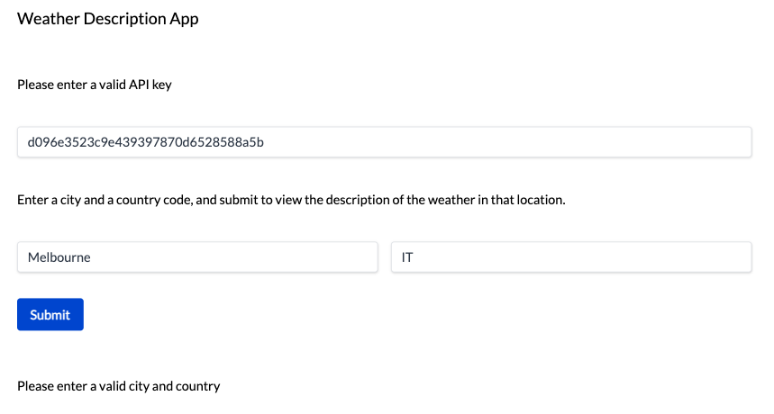
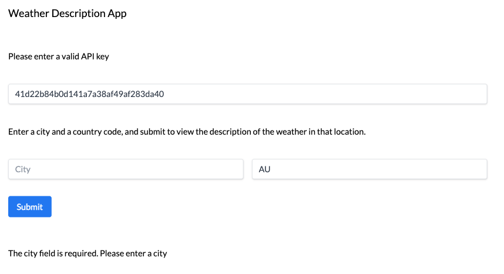
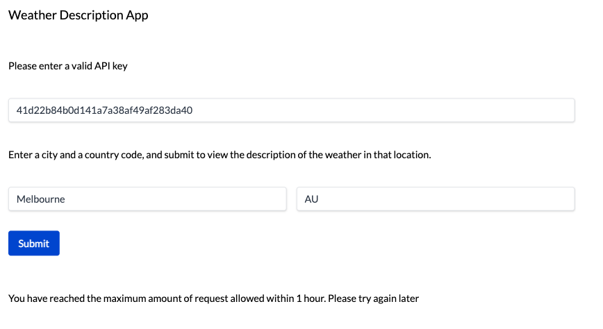
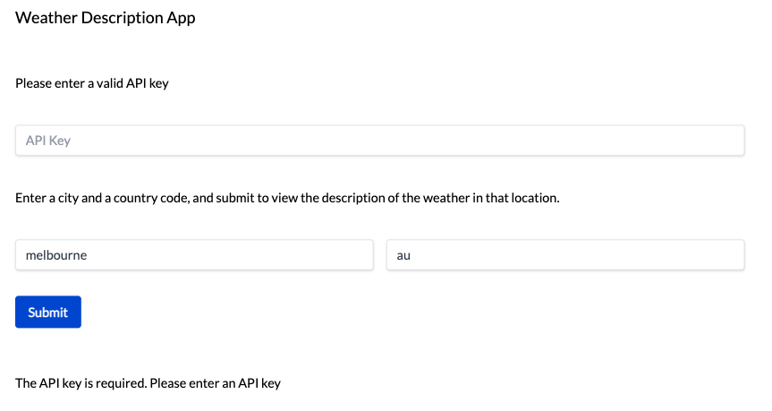
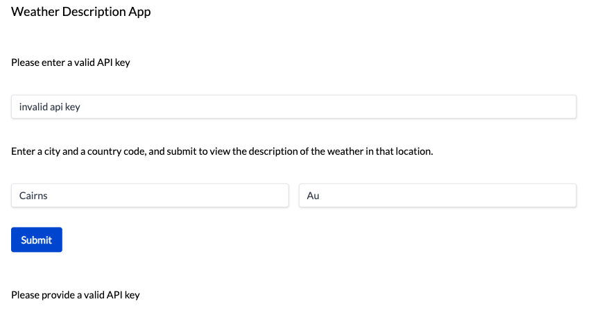

# Weather Application

# Contents
[Introduction](https://github.com/sophieleegoh/Weather-App?tab=readme-ov-file#introduction)

[Webpage Features](https://github.com/sophieleegoh/Weather-App?tab=readme-ov-file#webpage-features)

[API Features](https://github.com/sophieleegoh/Weather-App?tab=readme-ov-file#api-features)
- [API Key Implementation Details](https://github.com/sophieleegoh/Weather-App?tab=readme-ov-file#api-key-implementation-details)
- [API Key Rate Limiting Implementation Details](https://github.com/sophieleegoh/Weather-App?tab=readme-ov-file#api-key-rate-limiting-implementation-details)

[Building/Running the Solution](https://github.com/sophieleegoh/Weather-App?tab=readme-ov-file#building-and-running-the-solution)
- [API](https://github.com/sophieleegoh/Weather-App?tab=readme-ov-file#building-and-running-the-api)
- [UI](https://github.com/sophieleegoh/Weather-App?tab=readme-ov-file#installing-dependencies-and-running-the-ui)

[Testing the Solution](https://github.com/sophieleegoh/Weather-App?tab=readme-ov-file#testing-the-solution)
- [Unit Tests](https://github.com/sophieleegoh/Weather-App?tab=readme-ov-file#running-api-unit-tests)
- [Integration Tests](https://github.com/sophieleegoh/Weather-App?tab=readme-ov-file#running-api-integration-tests)
- [UI Tests](https://github.com/sophieleegoh/Weather-App?tab=readme-ov-file#running-ui-tests)
- [Manually Testing via the UI](https://github.com/sophieleegoh/Weather-App?tab=readme-ov-file#manually-testing-via-the-ui)
- [Manually Testing the API](https://github.com/sophieleegoh/Weather-App?tab=readme-ov-file#manually-testing-the-api)

[Example Screenshots of the UI](https://github.com/sophieleegoh/Weather-App?tab=readme-ov-file#example-screenshots-of-the-ui)

# Introduction
In this repository, you will find a webpage UI built with `React` and an API created using `.NET`.

Please note that although the technical challenge description specified that both the UI and API should accept a city name and country **name**, the UI and API that I have implemented accept a city name and a country **code**. According to the [OpenWeatherMap documentation](https://openweathermap.org/current#:~:text=https%3A//api.openweathermap.org/data/2.5/weather%3Fq%3D%7Bcity%20name%7D%2C%7Bcountry%20code%7D%26appid%3D%7BAPI%20key%7D), it states that it requires a city name and country code, instead of a country name.

If you provide a full country name to the Open Weather Map endpoint, it often still returns a response, however, in the situation where you provide a city that exists in multiple countries, I believe that behind the scenes, it is making an assumption of which country you are looking for. As such, it feels a little unusual to deliberately enforce that a user enters a full country name, instead of a country code, as this is what the underlying API is looking for. I have reached out to a team member and they have validated that for this technical challenge, it would be suitable to accept a city name and country code.

I have also not enforced that a user enters a country code. This is because the Open Weather Map endpoint can produce a result with just the city name only. As a result, the country code input is optional, however, if provided, it strictly needs to be a 2-letter country code.

To learn more about country codes, please refer to [ISO 3166](https://www.iso.org/obp/ui/#iso:pub:PUB500001:en).

## Webpage Features

1. Provide the user with basic instructions on how to interact with the UI, and allow the user to enter a city name and country code. The user must also enter an API key
2. When the user clicks on the Submit button, the result is displayed below
   1. If successful, the result will just contain the weather description. If there are multiple descriptions returned, they will be separated by a comma.
   2. If there have been non-fatal validation issues, a warning will also be displayed in addition to the weather description if possible.
   3. If the validation issues were fatal, an error message will be displayed to inform the user how to proceed.

## API Features

1. There is 1 REST endpoint (`/weather`) that accepts both the city name and country code.
2. This endpoint requires the following:
   1. A query parameter specifying the city
   2. Another query parameter specifying the country code
   3. A valid API key
3. 5 API keys have been created.
4. Each API key has been limited to 5 weather reports per hour.
5. Before calling the OpenWeatherMap service, it is validated that the city provided is a non-empty string. Based on the behaviour of the OpenWeatherMap service, the country is an optional string and I have chosen the leave the validation of this string to the OpenWeatherMap service.

### API Key Implementation Details

The API Key is passed as a header, where the key is `API-KEY`. If the provided API key is invalid or missing, the endpoint will return the HTTP status code `401`, indicating that the request is lacking valid authentication credentials.

For the purpose of this challenge, I have hardcoded 5 arbitrary, randomly generated strings into the `appsettings.json` that are used as the API keys for the WeatherAPI (not to be mistaken for the Open Weather Map API Keys). Please note that if this were to be used by an application in production, I would store the API keys more securely, eg. using Azure Key Vault or AWS Secrets Manager.

It is usually seen as bad practice to commit an API key to a repository, as the git history will stay public forever (unless overwritten). Even if the git history is no longer public, you do not know if someone who should not have had direct access to this API key has already saved this somewhere. As such, it is better practice to securely store API keys elsewhere and if they are accidentally leaked, there is ideally a mechanism to easily rotate them. For this particular exercise, I have committed it for demonstration purposes. If you would like to rotate the API keys, you can easily do so by setting them as environment variables (eg. `export ApiKeys__0="new api key"`, where 0 is the index of the `ApiKeys` array in `appsettings.json`).

### API Key Rate Limiting Implementation Details

In .NET 8.0, there is an inbuilt rate limiting middleware which I have utilised. See more [here](https://learn.microsoft.com/en-us/aspnet/core/performance/rate-limit?view=aspnetcore-8.0).

I used a Fixed Window Rate Limiter and set the partition key to the API key from the HTTP request.

If this application was in production, I would ensure that the rate-limiting solution persisted (eg. in a database, cache, etc.). It would be important to persist the rate-limiting in a central location if the WeatherAPI service went down, and we wanted to be able to restore the service without inadvertently increasing a user's limit. This would be particularly important if we wanted to create multiple instances of the WeatherAPI service running concurrently. If we did not use persistent storage, users might observe that they can sometimes retrieve over 5 weather reports if their requests are sent to different WeatherAPI instances.

# Building and Running the Solution

## Building and Running the API

Note: these instructions assume that you already have .NET 8.0 installed on your machine. If you do not, please follow the instructions [here](https://dotnet.microsoft.com/en-us/download/dotnet/8.0).

1. Ensure that you are in the root directory
2. Next, run `dotnet build`
3. Set an environment variable called `OPEN_WEATHER_MAP_API_KEY` to a valid OpenWeatherMap Api Key
4. (Optional) If you would like to replace the API keys specified in the `appsettings.json`, set environment variable(s) to override these values eg. `export ApiKeys__0="new api key"`, where 0 is the index of the `ApiKeys` array in `appsettings.json`
5. Change to the `/WeatherApi` directory
6. Run `dotnet run` to run the server

The API service should now be reachable at `http://localhost:5000/`.

## Installing Dependencies and Running the UI

Note: these instructions assume that you already have Node and npm. If you do not, please follow the instructions [here](https://docs.npmjs.com/downloading-and-installing-node-js-and-npm).

1. Change to the `/weather-app` directory
2. Run `npm install` to install all dependencies
3. Run `npm start`

The UI should now be reachable at `http://localhost:3000/`.

### Other useful commands you can run

- `npm run lint` will lint the code. It will attempt to automatically fix what it can and anything that it cannot will be displayed in the terminal.
- `npm run coverage` will produce test coverage results.

# Testing the Solution

## Running API Unit Tests

1. Navigate to the `WeatherApi.UnitTests` directory
2. Run `dotnet test`. There should be 2 unit tests that run

## Running API Integration Tests

1. Navigate to the `WeatherApi.IntegrationTests` directory
2. If you have not already set the environment variables `ApiKeys__0` and `ApiKeys__1`, you will need to set them to the corresponding values in `appsettings.json` file or the values that you have chosen to set. The reason for only setting 2 API keys is that there are only 2 that were utilised in the Integration tests
3. Run `dotnet test`. There should be 5 integration tests that run

## Running UI Tests

1. Navigate to the `weather-app` directory
2. If you have not already set the environment variables `ApiKeys__0` and `ApiKeys__1`, you will need to set them to the corresponding values in `appsettings.json` file or the values that you have chosen to set. The reason for only setting 2 API keys is that there are only 2 that were utilised in the UI tests
3. Run `npm run test`. There should be 16 tests that run

## Manually Testing via the UI

1. Run the API solution (see [here](https://github.com/sophieleegoh/Weather-App?tab=readme-ov-file#example-screenshots-of-the-ui))
2. Start the UI (see [here](https://github.com/sophieleegoh/Weather-App?tab=readme-ov-file#example-screenshots-of-the-ui))
3. Go to `http://localhost:3000/`
4. Enter an API key, a city name and a country code
5. Click on the `Submit` button

## Manually Testing the API

There are several ways that you can test the API (eg. `curl`, using Postman, etc.).

An example of a valid curl command:
        
    curl --location 'http://localhost:5000/weather?country=au&city=melbourne' --header 'API-KEY: d096e3523c9e439397870d6528588a5b'

Note: if you have replaced the API keys, you will need to update the `API-KEY` value in the above curl command.

# Example Screenshots of the UI

## When a valid city and country code has been entered

### With 1 weather description returned from the API

Web experience on a laptop/larger device:

Web experience on a mobile device:

Note: For the remaining scenarios, only the laptop/larger device experience is captured to reduce repetition.

### With 2 weather descriptions returned from the API

Note: if there were additional weather descriptions, they would also be comma-separated within the quotation marks

## When a valid city and country code is empty

## When the API cannot find the specified city and/or country

### With an invalid city but valid country code

### With a city that is not found within the specified valid country code

## When an invalid city and invalid country code are provided

## When no city is provided

## When you have reached the maximum number of requests allowed within 1 hour

## When the WeatherAPI Api Key has not been provided correctly

### When no WeatherAPI Api Key has been provided

### When an invalid WeatherAPI Api Key has been provided

